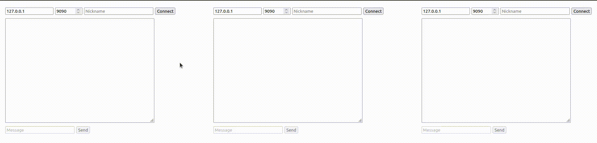

# WebSocketServer

A [WebSocket](https://en.wikipedia.org/wiki/WebSocket) server written in PHP.

>If you like this project gift us a ⭐.

## Installation.

    $ composer require thenlabs/websocket-server 1.0.x-dev

>This project has not a stable version yet.

## Usage.

In the `example` directory exists a demo project which implements a bare chat server.

The `example/MyChatServer.php` file contain the class which, like you can see, implements the logic of the server through an event system.

```php
<?php
// example/MyChatServer.php

use ThenLabs\WebSocketServer\Event\CloseEvent;
use ThenLabs\WebSocketServer\Event\MessageEvent;
use ThenLabs\WebSocketServer\Event\OpenEvent;
use ThenLabs\WebSocketServer\WebSocketServer;

class MyChatServer extends WebSocketServer
{
    protected $users = [];

    public function onOpen(OpenEvent $event): void
    {
        $request = $event->getRequest();
        $nickname = explode('/', $request->getRequestUri())[1];

        // notify to the connected users previously.
        foreach ($this->users as $user) {
            $user->send("User '{$nickname}' has connected.");
        }

        // add the new user to the list.
        $this->users[$nickname] = $event->getConnection();
    }

    public function onMessage(MessageEvent $event): void
    {
        $senderUser = $event->getConnection();
        $senderNick = array_search($senderUser, $this->users);

        $message = $event->getMessage();

        // send the message to the other users.
        foreach ($this->users as $user) {
            if ($user !== $senderUser) {
                $user->send("{$senderNick}: {$message}");
            }
        }
    }

    public function onClose(CloseEvent $event): void
    {
        $user = $event->getConnection();
        $nickname = array_search($user, $this->users);

        // notify to the other users.
        foreach ($this->users as $otherUser) {
            if ($otherUser !== $user) {
                $otherUser->send("The user {$nickname} has disconnected.");
            }
        }

        unset($this->users[$nickname]);
    }
}
```

The `example/start-server.php` file contains the script which starts the server.

```php
<?php
// example/start-server.php

require_once __DIR__.'/../vendor/autoload.php';
require_once __DIR__.'/MyChatServer.php';

$config = [
    'host' => $argv[1] ?? '127.0.0.1',
    'port' => $argv[2] ?? 9090,
];

$server = new MyChatServer($config);
$server->start();
```

This file should be executed as next:

    $ php example/start-server.php

In order to test the example, we can use the `example/index.html` file which contains three clients which can be used like it's shown next:



## Development.

### Running the tests.

Start the selenium server.

    $ java -jar path/to/selenium-server-standalone-x.y.z.jar

Run [PyramidalTests](https://github.com/thenlabs/pyramidal-tests).

    $ ./vendor/bin/pyramidal